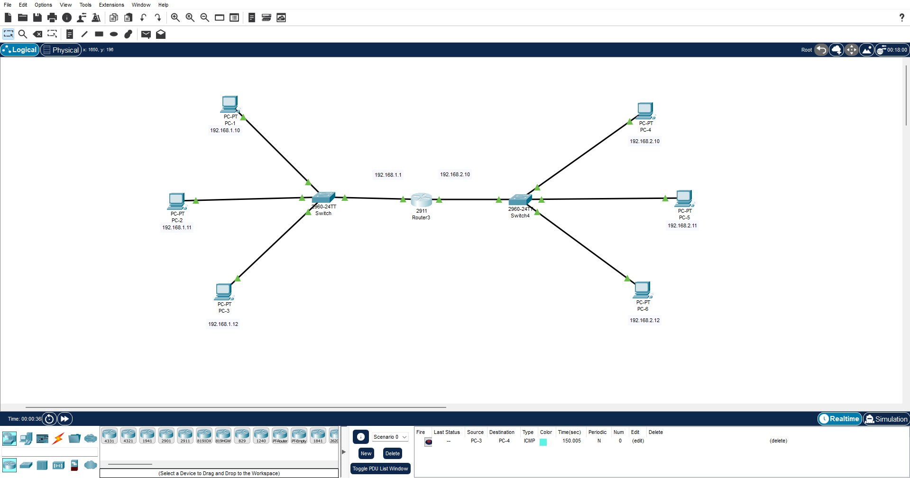
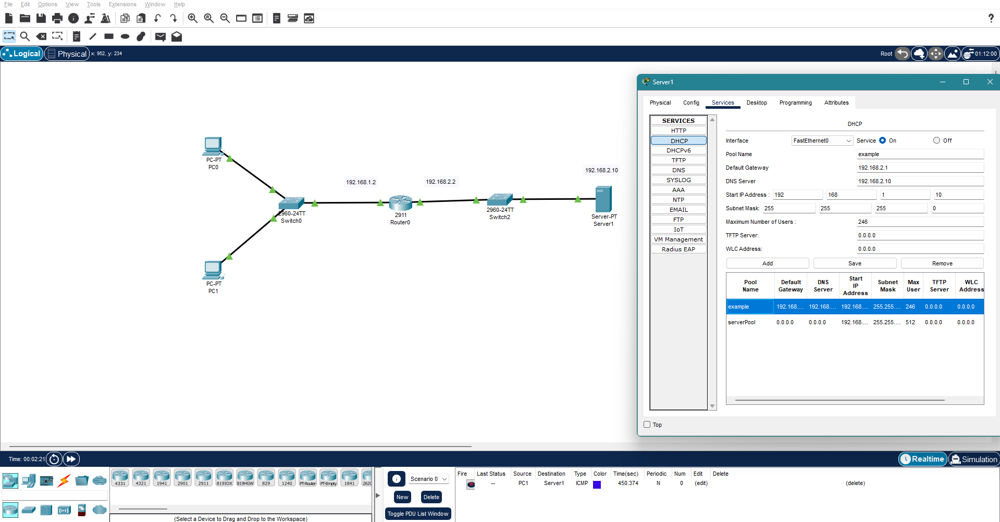
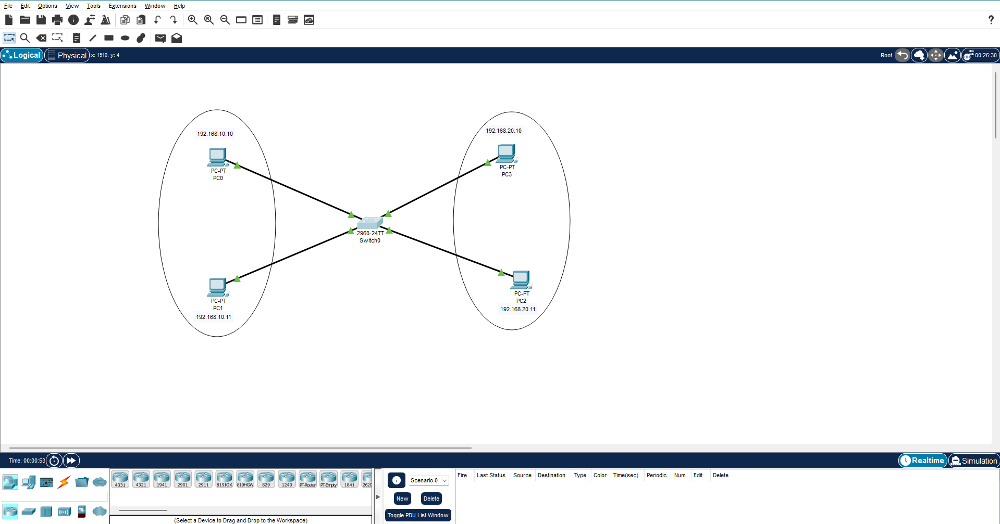
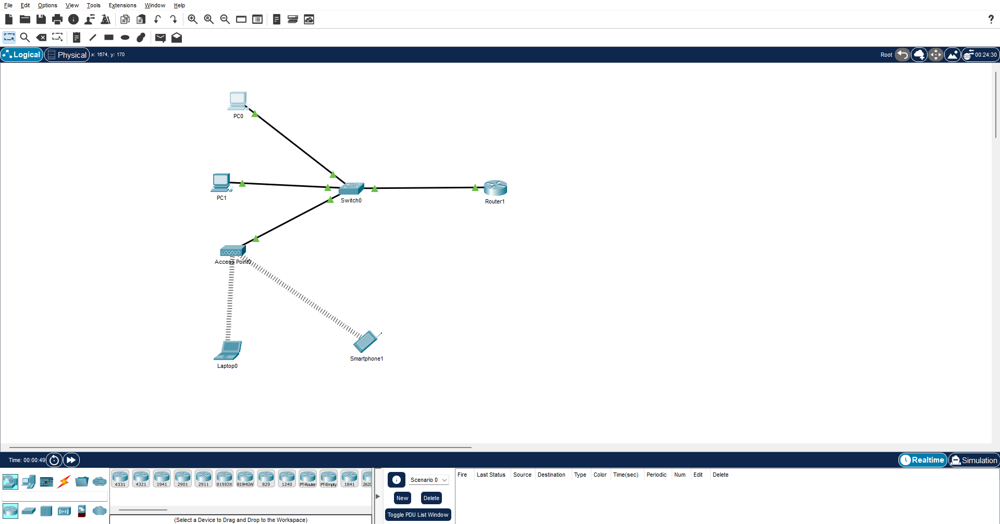
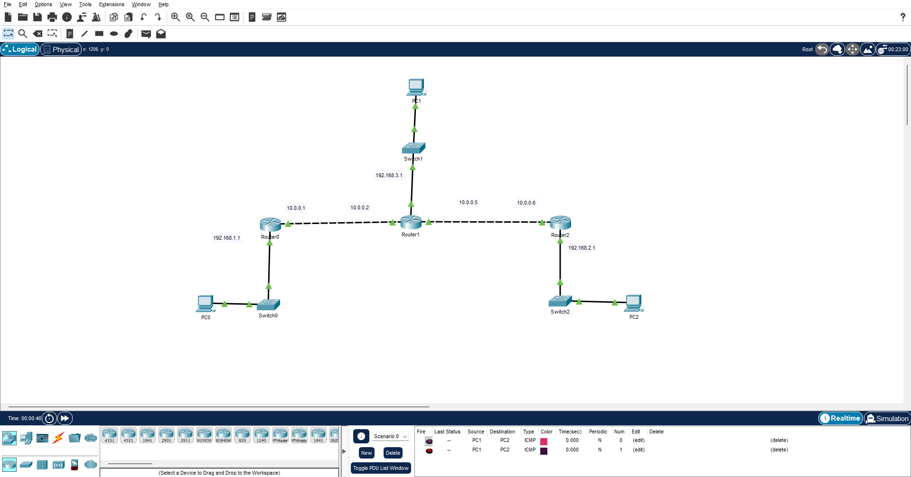
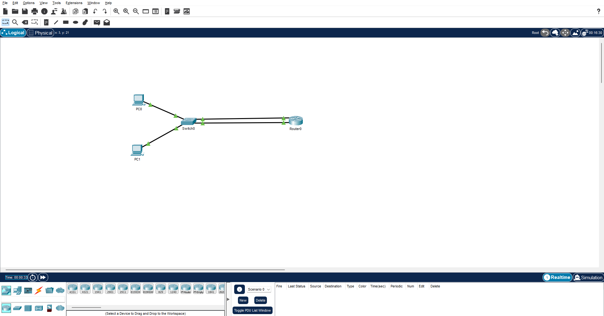
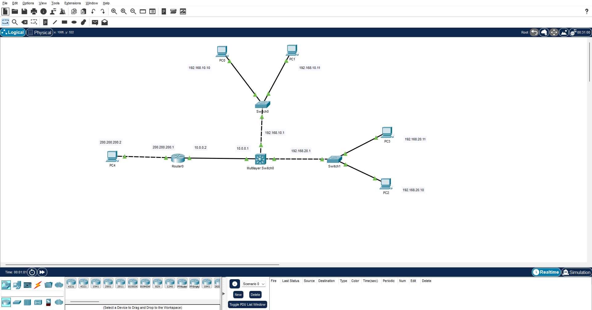

# Cisco Packet Tracer Basic Labs

Welcome to the **Cisco Packet Tracer Basic Labs** repository!  
This repository contains a collection of hands-on network labs designed for students, network enthusiasts, and anyone who wants to practice Cisco networking fundamentals in a structured and comprehensive way.

The main purpose of this repository is to provide practical exercises that reinforce theoretical knowledge. Each lab simulates real-world scenarios, helping you understand how network devices, protocols, and services interact in a professional environment.

---

## 📚 Purpose and Learning Goals

By using these labs, you will gain practical experience in:  

- **LAN/WAN Routing:** Understanding how to connect multiple local networks and route traffic between them.  
- **VLAN and InterVLAN Configurations:** Configuring VLANs and routing traffic between them using Layer 3 switches or routers.  
- **DHCP and DNS Services:** Automating IP address allocation and domain name resolution in a network.  
- **Access Control Lists (ACLs):** Learning how to restrict or allow traffic based on IP addresses.  
- **Wireless Networks:** Setting up basic wireless networks, including Access Point configuration and security.  
- **Dynamic Routing (OSPF):** Understanding how dynamic routing protocols work and automatically update routing tables.  

These labs are ideal for:  
- Networking students preparing for **CCNA or similar certifications**.  
- Individuals who want to **reinforce networking concepts through practice**.  
- Teachers or trainers looking for **ready-made lab scenarios**.  

---

## 📂 Repository Structure

```text
cisco-packet-tracer-basic/
│
├── README.md                   # This file
├── cisco-lab-examples/         # Packet Tracer files (.pkt)
│   ├── lan-to-lan-routing.pkt
│   ├── dhcp-dns-routing.pkt
│   ├── intervlan-routing.pkt
│   ├── basic-wireless-network.pkt
│   ├── dynamic-routing-ospf.pkt
│   ├── standard-acl-lab.pkt
│   └── campus-network.pkt
└── images/                      # Screenshots of lab topologies
    ├── lan-to-lan-routing.png
    ├── dhcp-dns-routing.png
    ├── intervlan-routing.png
    ├── basic-wireless-network.png
    ├── dynamic-routing-ospf.png
    ├── standard-acl-lab.png
    └── campus-network.png


```

## 📸 Lab Previews

Below is a preview of the lab topologies included in this repository.  
Click on each image to view the full version in the repository.

<table>
  <tr>
    <td align="center">
      <br>
      LAN to LAN Routing
    </td>
    <td align="center">
      <br>
      DHCP DNS Routing
    </td>
    <td align="center">
      <br>
      InterVLAN Routing
    </td>
  </tr>
  <tr>
    <td align="center">
      <br>
      Basic Wireless Network
    </td>
    <td align="center">
      <br>
      Dynamic Routing with OSPF
    </td>
    <td align="center">
      <br>
      Standard ACL Lab
    </td>
  </tr>
  <tr>
    <td align="center">
      <br>
      Campus Network
    </td>
  </tr>
</table>

---

## 📝 Detailed Lab Descriptions

### 1. LAN to LAN Routing
**Goal:** Understand how to connect two separate LANs and enable communication between them.  
**Description:**  
In this lab, you will configure static routing between two local area networks. You will set up routers, configure IP addresses for each interface, and test connectivity using the ping command. This lab helps you understand the basics of routing tables, network addressing, and inter-network communication.  

**Skills practiced:**  
- Router interface configuration  
- Static routing setup  
- Troubleshooting connectivity between LANs  

**File:** `cisco-lab-examples/lan-to-lan-routing.pkt`  
**Screenshot:** `images/lan-to-lan-routing.png`  

---

### 2. DHCP DNS Routing
**Goal:** Automate IP addressing and implement DNS name resolution.  
**Description:**  
This lab introduces DHCP and DNS configuration. You will configure a DHCP server to automatically assign IP addresses to network devices. Additionally, a DNS server will be set up to resolve hostnames to IP addresses. This lab teaches the importance of dynamic IP allocation and name resolution in networks.  

**Skills practiced:**  
- Configuring DHCP pools and options  
- Setting up DNS zones and records  
- Testing client connectivity and hostname resolution  

**File:** `cisco-lab-examples/dhcp-dns-routing.pkt`  
**Screenshot:** `images/dhcp-dns-routing.png`  

---

### 3. InterVLAN Routing
**Goal:** Enable communication between multiple VLANs within a network.  
**Description:**  
This lab covers VLAN creation, port assignment, and inter-VLAN routing using a router-on-a-stick or Layer 3 switch. You will learn how to segment a network for security and efficiency while maintaining communication between VLANs.  

**Skills practiced:**  
- VLAN creation and assignment  
- Trunk port configuration  
- Router-on-a-stick configuration  

**File:** `cisco-lab-examples/intervlan-routing.pkt`  
**Screenshot:** `images/intervlan-routing.png`  

---

### 4. Basic Wireless Network
**Goal:** Set up a simple wireless network with security.  
**Description:**  
Learn how to configure Access Points (APs) and connect wireless devices. You will assign SSIDs, configure encryption, and ensure devices can communicate with the wired network.  

**Skills practiced:**  
- Wireless network setup  
- AP configuration and security  
- Device connectivity testing  

**File:** `cisco-lab-examples/basic-wireless-network.pkt`  
**Screenshot:** `images/basic-wireless-network.png`  

---

### 5. Dynamic Routing with OSPF
**Goal:** Understand how dynamic routing protocols automate network traffic management.  
**Description:**  
This lab introduces OSPF (Open Shortest Path First). You will configure multiple routers to share routing information dynamically. OSPF ensures that network changes are propagated automatically, reducing manual configuration.  

**Skills practiced:**  
- OSPF router configuration  
- Neighbor relationships and routing updates  
- Route verification and troubleshooting  

**File:** `cisco-lab-examples/dynamic-routing-ospf.pkt`  
**Screenshot:** `images/dynamic-routing-ospf.png`  

---

### 6. Standard ACL Lab
**Goal:** Control network access using Access Control Lists (ACLs).  
**Description:**  
Learn how to restrict or allow traffic based on IP addresses. You will configure standard ACLs on routers to permit or deny certain devices from accessing network resources.  

**Skills practiced:**  
- ACL creation and application  
- Filtering traffic based on IP  
- Testing and verifying ACL rules  

**File:** `cisco-lab-examples/standard-acl-lab.pkt`  
**Screenshot:** `images/standard-acl-lab.png`  

---

### 7. Campus Network
**Goal:** Build a full campus network topology with multiple layers.  
**Description:**  
This lab simulates a real-world campus network, including core, distribution, and access layers. You will implement VLANs, routing, and basic security settings. This comprehensive lab helps consolidate all previously learned concepts.  

**Skills practiced:**  
- Multi-layer network design  
- VLAN, routing, and security configuration  
- Network troubleshooting  

**File:** `cisco-lab-examples/campus-network.pkt`  
**Screenshot:** `images/campus-network.png`  

---

## ⚡ How to Use
1. Install Cisco Packet Tracer on your computer.  
2. Open any `.pkt` file from the `cisco-lab-examples/` folder.  
3. Examine device configurations, topology, and connectivity.  
4. Simulate network behavior or make changes to practice your skills.  

---

## 📌 Notes and Tips
- **File Names:** Ensure the image and `.pkt` file names exactly match what is in README.md (case-sensitive).  
- **Learning Tip:** Follow each lab step by step and verify connectivity after each configuration.  
- **Contribution:** Feel free to fork this repository and add your own labs or improvements.  

---

## 🔗 References
- Cisco Packet Tracer Official Documentation  
- CCNA Study Guides  
- Networking textbooks and lab manuals  
